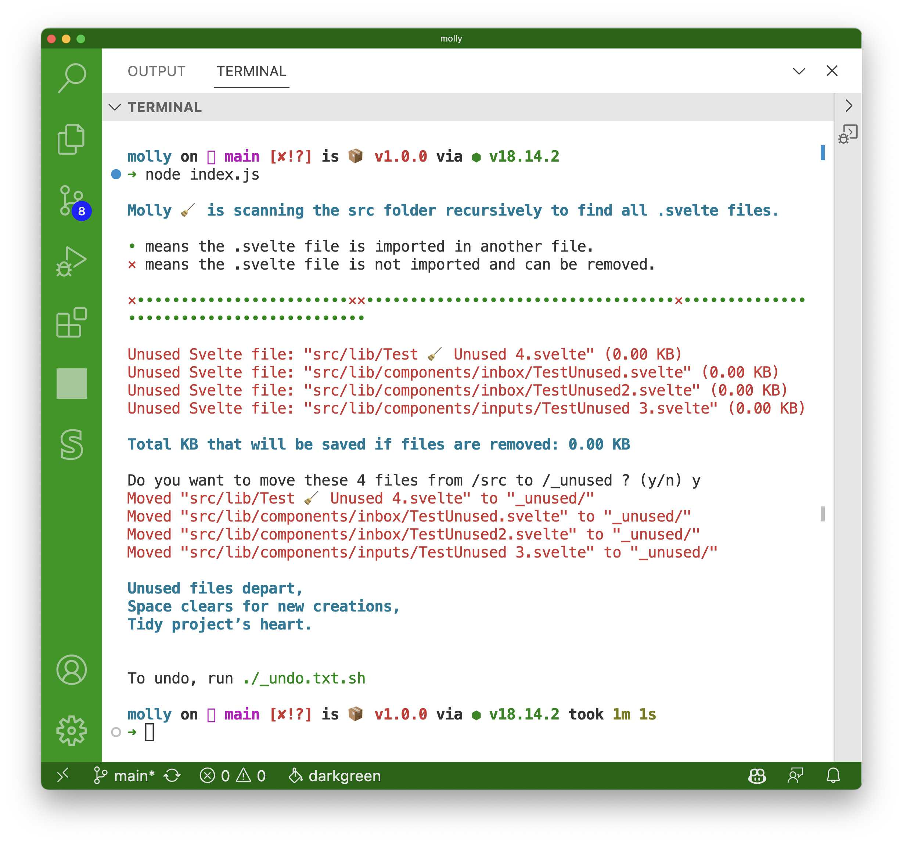

# Molly 🧹


Molly (or `lilmolly` on `npm`) is a `bash` script and **npm module** that helps you clean up unused Svelte components in your project, giving your codebase a breath of fresh air and enhancing its tidiness. (Yes, I know the Svelte compiler tree-shakes your code at build time so that unused components aren’t included in the bundle, but here we are talking about cognitive tidiness, less hunting for the right component, and, well, a better developer experience.) Molly identifies and, if you like, removes Svelte components that are not imported in your project. And if, after running Molly, you need to restore components you accidentally removed, just run Molly’s undo bash script, et voilà!—removed files are back where they were.



## Table of Contents

- [Molly 🧹](#molly-)
  - [Table of Contents](#table-of-contents)
  - [Features](#features)
  - [Quickstart](#quickstart)
  - [Example Output](#example-output)
  - [Reporting Issues](#reporting-issues)
  - [Contributing](#contributing)
  - [License](#license)

## Features

- Scans your project to find all .svelte files and checks if they are imported in any other files.
- Lists unused Svelte components for easy reference.
- Offers to move the unused components to an `_unused` directory.
- When you are confident those files are no longer need in your app, you can delete them. (Tip: Add `_unused` to your `.gitignore`.)
- Creates an `_undo.txt.sh` bash script that, if you run it, moves the files in `_unused` back to their original location in `src`, then deletes itself. ♻️!
- Provides a delightful selection of witty haikus about tidying up your project files, which some say, [spark joy](https://www.youtube.com/watch?v=9AvWs2X-bEA).

## Quickstart

To get started with Molly and tidy up your Svelte project, follow these easy steps:

1. **Install Molly**: Either
   - `npm install --global lilmolly` **or**
   - Download `lib/molly.sh` into your Svelte project app root (just above `src`) and make it executable with `chmod +x lilmolly.sh`

2. **Run Molly**: Navigate to the root of your Svelte or SvelteKit project and run Molly:
   - `lilmolly` (Node JS version) **or**
   - `./molly.sh` (Bash script)

Molly will scan your project's `src` folder for .svelte files and display their usage status with dots and x’s:

- A dot `•` means the .svelte file is imported in another file.
- An x `×` means the .svelte file is not imported and can be removed.

1. **Review and Move Unused Components**: After scanning, Molly will display a summary of the unused components and the total KB that can be saved if they are moved to the `_unused` directory. If you wish to move the unused components, type `y` when prompted.

2. **Undo the Operation**: If you need to restore components you accidentally moved, run the undo bash script generated by Molly: `./_undo.txt.sh`

3. **Enjoy a Haiku**: Once the cleanup is done, a delightful, random haiku about tidying up will be displayed. Take a moment to enjoy it and let the joy of tidiness spark in your project.

Note: Before using Molly, ensure you have a backup of your code or your code is checked into a version control system. Molly moves files but a little precaution can go a long way.

## Example Output

```
Molly 🧹 is scanning the src folder recursively to find all .svelte files.

• means the .svelte file is imported in another file.
× means the .svelte file is not imported and can be removed.

ו•••••••••••••••••••••••×ו••••••••••••••••••••••••••••••••••×•••••••••••••••••••••••••••••••••••••••••

Unused Svelte file: "src/lib/Test 🧹 Unused 4.svelte" (1.00 KB)
Unused Svelte file: "src/lib/components/inbox/TestUnused.svelte" (1.00 KB)
Unused Svelte file: "src/lib/components/inbox/TestUnused2.svelte" (1.00 KB)
Unused Svelte file: "src/lib/components/inputs/TestUnused 3.svelte" (1.00 KB)

Total KB that will be saved if files are removed: 4.00 KB

Do you want to move these 4 files from /src to /_unused ? (y/n) y
Moved "src/lib/Test 🧹 Unused 4.svelte" to "_unused/"
Moved "src/lib/components/inbox/TestUnused.svelte" to "_unused/"
Moved "src/lib/components/inbox/TestUnused2.svelte" to "_unused/"
Moved "src/lib/components/inputs/TestUnused 3.svelte" to "_unused/"

With each file removed,
The codebase breathes freely,
Joy sparks in tidiness.

To undo, run ./_undo.txt.sh
```

## Reporting Issues

Molly aims to simplify and enhance your Svelte project tidying experience. If you encounter any issues or have suggestions for improvements, we encourage you to report them. Here's how you can do that:

1. **Check Existing Issues**: Before creating a new issue, please check the [existing issues](https://github.com/renefournier/molly/issues) to see if your problem or suggestion has already been reported. If it has, you can contribute by commenting with additional information.

2. **Create a New Issue**: If your problem or suggestion is not already reported, [create a new issue](https://github.com/renefournier/molly/issues/new). Please provide as much detail as possible so we can understand and reproduce the issue. Useful information includes:

   - The version of Molly you're using
   - Steps to reproduce the issue
   - The expected and actual outcomes
   - Any relevant error messages

We appreciate your contributions to making Molly better. All issues, questions, and contributions are welcomed!

## Contributing

Contributions to Molly are welcome! If you find any issues or have ideas for improvements, feel free to open an issue or submit a pull request.

## License

This project is licensed under the [MIT License](LICENSE).

---

Give Molly a try, and let her help you keep your Svelte project neat and tidy! 🧹
